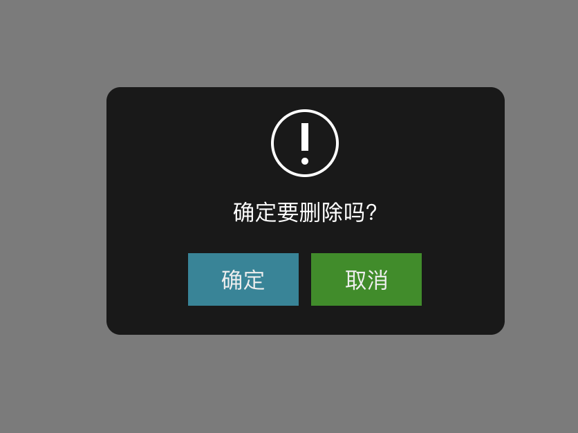
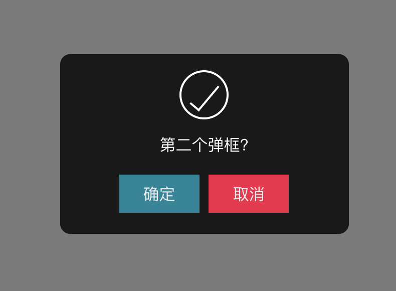
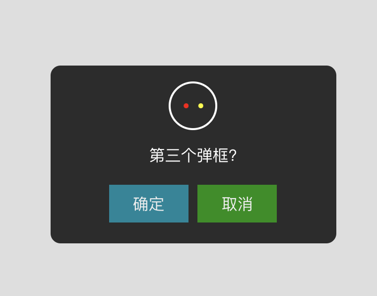

<p align="center">
    
</p>

##  介绍
你好，我是徐晓东，笔名燕云长风。大漠穷秋于 2019-03-16 21:22 赠此笔名。   
寓意：结合李白著名的边塞诗《关山月》取【燕云长风】—— 长风几万里，吹度玉门关。

yycf-dialog 是一个基于Angular开发的通用业务组件库，包含Loading, Message, Confirm

## 安装
```
   npm  install yycf-dialog 
```

## 效果预览

  <p align="center">
    
  </p>  

  <p align="center">
    
  </p>
    
  <p align="center">
    
  </p>


## 使用

```
import { DialogModule, DialogService} from 'yycf-dialog/components';

<yycf-dialog [key]="'1'"></yycf-dialog>
<yycf-dialog [key]="'2'"></yycf-dialog>
<yycf-dialog [key]="'3'"></yycf-dialog>

//自定义的footer button 需要自定义button样式，或者直接使用其他组件库的button
<yycf-dialog [key]="'4'" #ct>
  <yycf-footer>
    <button class="customButtonClass" (click)="ct.accept()">确定<button>
    <button class="customButtonclass" (click)="ct.reject()">取消<button>
  <yycf-footer>
<yycf-dialog>

export class DialogDemo  implements OnInit{ 
           
    constructor(private dialogService: DialogService) {}
 
    ngOnInit(){

     this.dialog.confirm(
      {
        message:'确定要删除吗?',
        header:'warning',
        okVisible:true,
        offVisible:true,
        okButton:'blue',
        offButton:'green',
        okLabel:``,
        key:"1",
        offLabel: ``,
        accept:()=>{
              this.dialog.confirm({
                message:'已删除',
                header:'ok',
                okVisible:true,
                offVisible:false,
                okButton:'blue',
                offButton:'red',
                okLabel:``,
                key:"2",
                // delay:3000,
                offLabel: ``,
                accept:()=>{
                  this.dialog.confirm({
                    message:'正在拼命加载……',
                    header:'waiting',
                    okVisible:false,
                    offVisible:false,
                    okButton:'blue',
                    offButton:'green',
                    okLabel:``,
                    key:"3",
                    // delay:3000,
                    offLabel: ``,
                  })

                },
                reject:()=>{

                }
              })
        },
        reject:()=>{

        }
      });
   }
}
```

| 参数     | 说明         | 类型         | 默认值 | 
|----------|-------------|-------------|-------|
| key   | 标识当前对话框的唯一性 | string     | null  |
| width   | 设置对话框宽度 | string     | auto  |
| height   | 设置对话框高度 | string     | auto  |
| opacity   | 设置对话框透明度 | number   | .5  |
| message   | 设置对话框标题 | string     | yycf-dialog component|
| header    | 对话框的类型   | 'waiting' 'ok' 'warning' | 'waiting'|
| okVisible   | 确定按钮的可见性 | boolean    | true  |
| offVisible   | 取消按钮的可见性 | boolean     | true  |
| okButton   | 确定按钮的颜色| 'blue'  'green'  'red'     | 'blue'  |
| offButton   | 取消按钮的颜色 | 'blue'  'green' 'red'     | 'green' |
| okLabel   | 确定按钮的内容|  string           | 确定 |
| offLabel   | 取消按钮的内容 | string         | 取消  |
| delay      | 指定对话框的生命周期| number (ms) |  null  |
| accept      | 确定按钮的回调函数| Function    |  null  |
| reject      | 取消按钮的回调函数| Function    |  null  |  
 
## PS:若回调函数的返回值为false ，则执行后不关闭对话框


## DialogService API  
 
  |名称    | 参数       |    描述  |
  |--------|----------|-------|
  |confirm |  object   | 创建对话框|
  |close   | 无        | 关闭对话框|  


  


  ``` 
      let dia = this.dialog.confirm({
        message:'正在拼命加载',
        header:'warning',
        okVisible:true,
        offVisible:true,
        okButton:'blue',
        offButton:'green',
        okLabel:``,
        offLabel: ``,
      });

      setTimeout(() => dia.close(),3000)

  ```

  


## 我参与的系列项目

* NiceFish：美人鱼，这是一个微型Blog系统，前端基于Angular7.0 + PrimeNG7.1.0。 https://gitee.com/mumu-osc/NiceFish
* NiceFish-React：这是React版的实现，界面外观完全相同。
  采用React Hooks 16.8.3 版本，使用TypeScript、Ant Design组件库以及Bootstrap v4.2.1 开发。 https://gitee.com/mumu-osc/NiceFish-React
* OpenWMS-Frontend： OpenWMS项目前端基于 Angular 7.0 + PrimeNG 7.1.0。 https://gitee.com/mumu-osc/OpenWMS-Frontend
* nicefish-spring-cloud： https://gitee.com/mumu-osc/nicefish-spring-cloud ，这是NiceFish的服务端代码，基于SpringCloud。已经完成了一些基本的功能，如 SpringSecurity+OAuth2+JWT 实现SSO，文章、用户、评论等的分页查询等。如果你需要与这个后端代码进行对接，请检出本项目的 for-spring-cloud 分支。

## 开源许可证

MIT

## 我的社交主页

1. [燕云长风知乎专栏](https://zhuanlan.zhihu.com/yanyunchangfeng)  
2. [燕云长风知乎](https://zhihu.com/people/hbxyxuxiaodong)  
3. [燕云长风Github](https://github.com/yanyunchangfeng)  
4. [燕云长风Gitee](https://gitee.com/yanyunchangfeng)  
 